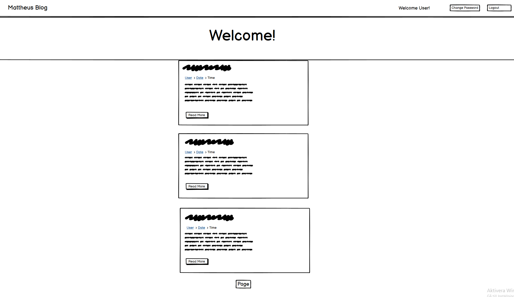

# Mattheus Travels

## Welcome to Mattheus Travels!

### Here you can join me on my adventures around the world, as I share my experiences through stunning images and short snippets of my travels.

Here's a link to the live website: https://my-django-blog-mattheus.herokuapp.com/

---
## Table of Contents
1. [**UX**](#user-experience)
    - [**User Stories**](#user-stories)
    - [**Typography/Color Scheme**](#typographycolor-scheme)
    - [**Wireframes**](#wireframes)

2. [**Features**](#features)
    - [**Existing Features**](#existing-features)
    - [**Features Left to Implement**](#features-not-yet-implemented)

3. [**Used Programs**](#used-programs)
    - [**Backend**](#backend)
    - [**Frontend**](#frontend)

4. [**Testing**](*testing)

5. [**Compatability**](#compatibility)

6. [**Deployment**](#deployment)

7. [**Credits**](#credits)

------

## User Experience, UX

Those visiting Mattheus Travels are people who enjoy traveling or are interested in learning about new places and cultures.

-----

## User Stories

As a site user i want to be able to:

- Register as a user
- Login to the blog
- Logout of the blog
- Change my password
- View posts
- Comment posts

&nbsp;

#### Typography/Color Scheme

Fonts used on the site are the google fonts [Roboto](https://fonts.google.com/specimen/Roboto) and [Alkatra](https://fonts.google.com/specimen/Alkatra?query=Alkatra). I choose to keep the color scheme light and easy with a mix of white, lightgrey, black and peach.

&nbsp;

### Wireframe

- I used [Balsamic-Wireframes](https://balsamiq.com/) to plan out my project, designing the style that I aimed for.
- This is what the initial mockup design looked like:

    

&nbsp;

---

## Features

&nbsp;

### Existing Features

&nbsp;

Options for the user changes depending on if user is logged in or not
- Users that are **NOT** logged in will be able to:
    - Register
    - Login
- Users that **ARE** logged in will be able to:
    - View Posts
    - Like Posts
    - Create Comments
    - Delete Comments
    - Edit Comments
    - Change Password
    - Logout
    - Delete Account
- Admins are able to:
    - View Posts
    - Create Posts
    - Delete Posts
    - Edit Posts
    - Create Comments
    - Delete Comments
    - Edit Comments
    - Create Users
    - Delete Users
    - Edit Users Info

&nbsp;

- **Status-Dependant Navbar**

    - Navbar changes depending on if the user is logged in or not.

- **Register**

    - Users are able to create their own accounts. The website makes sure that each username is unique and that the password meets all of the requirements.

- **Login**

    - Users are able to login to their accounts. The website makes sure that the username typed in is in the database, and that the password is correct.

- **Logout**

    - Users are able to logout of their accounts and are then redirected to a prompt to login again.

- **Change Password**

    - Users are able to change their password. They are presented with a form asking for their old password and their new password, aswell as confirming the new one. After they are shown a prompt saying their password has been changed and a button directing them to the home page.

- **Posts**

    - Users are able to view posts.

- **Comment**

    - Users are able to comment on posts. They are also able to edit their comments and delete them.

- **Like**

    - Users are able to like/unlike posts.

- **Pagination**

    - Three posts are displayed on each page to not make the page too flooded with information. Pagination has been added so that the user can easily move through all of the posts.

&nbsp;

## Features not yet implemented

- **Search Function**

    - Users will be able to search for specific posts.

- **Dark Mode**

    - Users will be able to toggle between light and dark mode.

&nbsp;

---

## Used Programs
- [Gitpod](https://www.gitpod.io/) - An open-source developer platform for remote development used for this project.
- [Github](https://github.com/) -  A code hosting platform also used in this project

### Backend

- **Heroku**
    - [Heroku](https://www.heroku.com) - Used for hosting this website
- **Python**
    - [Python 3.8.11](https://www.python.org/) - Python is an interpreted, high-level, general-purpose programming language and is the language used for all backend functions of this project.
- **Django**
    - [Django 4.1.2](https://www.djangoproject.com/) - Django is a high-level Python Web framework that encourages rapid development and clean, pragmatic design.
- **Gunicorn**
    - [Gunicorn 20.1.0](https://gunicorn.org/) - Gunicorn is a Python WSGI HTTP Server for UNIX.

### Frontend

- **HTML**
    - [HTML](https://developer.mozilla.org/en-US/docs/Web/Guide/HTML/HTML5) - The fundamental code structure for all webpages.
- **CSS**
    - [CSS](https://sv.wikipedia.org/wiki/Cascading_Style_Sheets) - A style sheet language used for describing the presentation of a document written in a markup language such as HTML.

    
&nbsp;

---

## Testing
Testing and results can be found [here](testing.md)
---

## Compatibility

The website was tested for full usability across the following browsers:

- Chrome
- Firefox
- Safari
- Samsung Internet Browser

&nbsp;

---

## Deployment

To deploy this project to Heroku you must do the following:

1. Create a **requirements.txt** file for heroku to install the requirements for the website.

2. Create a **Procfile** for Heroku to know what type of application to run and how to run it.

3. Log in to Heroku then create your new app. Click on **Deploy** then scroll down to deployment method. Select **GitHub** as deployment method, scroll down and choose branch then click on **Deploy Branch**. You can also choose to **Enable Automatic Deploys**, which will update your app on heroku everyone you update it on your github pages.

&nbsp;

---

## Credits 

- Countless YouTube videos for inspiration
